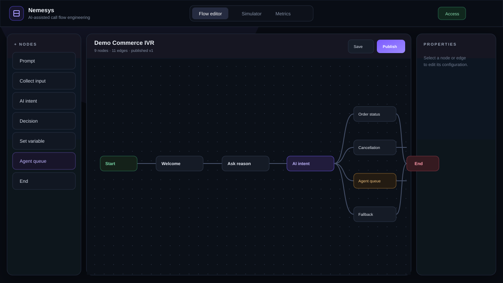

# Nemesys

[](https://github.com/felipetunes/nemesys/actions/workflows/ci.yml)
[](https://github.com/felipetunes/nemesys/releases)
[](LICENSE)

**Current project version: `0.16.0` — focused profile navigation and vertical Architect flows**

**A visual, AI-assisted IVR flow builder and runtime for learning, prototyping and portfolio demos.**



Nemesys is a full-stack project that lets you design a call flow visually, run it in a browser simulator, inspect every execution event and optionally connect a real phone number through Twilio or a signed generic webhook adapter.

> The repository is intentionally provider-neutral at its core. The included Twilio adapter is only one example of how a telephony provider can drive the same flow engine.

## Why this project exists

Traditional IVRs are often built inside proprietary platforms. Nemesys exposes the core ideas as code:

- graph-based flow design;
- deterministic runtime state machine;
- prompt and input handling;
- DTMF and free-text/speech intent input;
- AI intent classification with structured JSON output;
- fallback classification when no OpenAI key exists;
- session variables and execution traces;
- REST APIs and persisted execution traces;
- optional real telephony webhook integration;
- Dockerized local environment;
- immutable published flow versions and durable SQL-backed sessions;
- automated backend and frontend quality checks;
- portable flow import/export with server-side validation;
- optional bearer-token protection for flow mutations;
- Alembic migrations and a PostgreSQL + Redis production profile;
- user login, revocable tokens and workspace-isolated data;
- retention controls and persisted-session metrics;
- a traceable human-agent queue simulator;
- browser speech controls and telephony speech-provider contracts;
- a signed, idempotent generic telephony webhook adapter;
- role-based workspace authorization with viewer, editor, admin and owner levels;
- workspace-safe identifiers and provider idempotency keys;
- login lockout, operational request IDs, security headers and readiness probes;
- persisted audit events for sensitive management operations;
- timestamped generic webhooks with replay-window enforcement;
- dependency vulnerability checks in CI and weekly automated update proposals;
- a Brazilian Portuguese interface by default, with login-language detection and profile-backed `PT-BR` / `EN-US` preferences;
- distinct **Architect**, **Collaborate** and **Administration** product areas;
- a Collaborate queue workspace where agents can inspect and claim waiting sessions;
- a persistent Architect catalog for creating, selecting and evolving multiple IVRs;
- contextual descriptions for every node type in the palette and flow canvas;
- IVR duplication, archival, restoration and protected permanent deletion;
- published-version comparison and rollback to the editable draft;
- provider-neutral flow outcomes with success/failure tracking and metrics;
- persistent agent presence and routing status;
- assigned-interaction handling and traceable after-call work with wrap-up codes;
- workspace user creation, roles, activation and removal from a dedicated administration area;
- an authenticated, customer-centered agent desktop with inbox, journey context and wrap-up controls;
- server-side agent identity enforcement that prevents an authenticated user from acting as another agent;
- a compact profile menu with settings, contextual Help and sign-out, plus a dismissible four-step quick-start guide;
- a task-oriented editor with collapsible action groups, explicit validation, vertical auto-layout, contextual instructions, unsaved-change protection and save-and-test workflow;
- actionable agent guidance with one-click queue entry and clear next-step messaging;
- progressive user-creation disclosure and plain-language role descriptions;
- consistent keyboard focus and a skip-to-content shortcut for accessible navigation;
- lazy-loaded visual editor for a substantially smaller initial application bundle;
- searchable and sortable IVR catalog for growing workspaces;
- an Architect-style toolbox that groups conversation, logic/data and resolution actions without hiding supported nodes;
- visible editor keyboard shortcuts for saving and testing;
- customer-first simulator with execution traces and session variables available on demand;
- a dedicated login portal that places every workspace behind an authenticated user by default;
- role-aware navigation and read-only experiences for viewers, with administrative controls reserved for admins and owners;
- explicit workspace switching, server-backed sign-out and automatic return to login when a session expires;
- an intentionally separate offline demo entry point when authentication is disabled;
- operating-system language detection before login and a profile-backed language preference after authentication;
- initial-owner registration shown only while the installation has no users;
- browser-persistent authentication that survives tab and browser restarts until explicit logout, revocation or configured server expiry.

## Product areas and languages

Nemesys separates design-time and operational responsibilities while keeping one provider-neutral runtime:

- **Architect** contains the multi-IVR catalog, visual flow editor, browser simulator, version history and runtime architecture view.
- **Collaborate** contains operational metrics and a customer-centered agent desktop with presence, routing status, inbox, journey context and after-call work.
- **Administration** contains workspace user creation, role assignment, activation/deactivation and member removal.

Before login, the interface follows the browser and operating-system language, mapping Portuguese variants to `pt-BR` and English variants to `en-US`. After authentication, the preference saved in the user's profile takes priority and follows that person across workspaces and devices. Language and workspace controls live under the avatar's **Settings** option so the primary navigation stays focused.

New users receive a four-step guide from IVR selection through browser testing and agent operation. **Help** remains available from the avatar menu with task-based shortcuts, and the guide can be dismissed without removing access to help.

## Demo flow

The seeded demo simulates an e-commerce service line:

```text
Start
  -> Welcome prompt
  -> Collect customer reason
  -> AI intent classification
      -> order_status -> Order status prompt -> End
      -> cancellation -> Cancellation prompt -> End
      -> human_agent -> Agent queue -> Simulated agent -> End
      -> fallback -> Clarification prompt -> End
```

## Architecture

```text
                         +----------------------+
                         |   React Flow Editor  |
                         +----------+-----------+
                                    |
                                    | REST
                                    v
+-------------+           +---------+----------+          +-----------------+
| Web Browser |<--------->|    FastAPI API     |<-------->|   SQLite / DB   |
|  Simulator  |           +---------+----------+          +-----------------+
+-------------+                     |
                                    v
                         +----------+-----------+
                         |     Flow Engine      |
                         | state machine + trace|
                         +----+-------------+---+
                              |             |
                              v             v
                        +-----------+   +-----------+
                        | OpenAI AI |   | Telephony |
                        |  Intent   |   |  Adapter  |
                        +-----------+   +-----------+
```

## Tech stack

### Frontend
- React + TypeScript
- Vite
- `@xyflow/react` for the visual graph editor
- Lucide icons

### Backend
- Python 3.11+
- FastAPI
- SQLAlchemy
- OpenAI Responses API integration
- SQLite by default, with a PostgreSQL production profile
- Pytest

### Infrastructure
- Docker / Docker Compose
- GitHub Actions

## Quick start

### 1. Clone and configure

```bash
git clone https://github.com/felipetunes/nemesys.git
cd nemesys
cp .env.example .env
```

An OpenAI key is **optional**. Without it, the project uses a deterministic local classifier so the demo still works.

### 2. Backend

```bash
cd backend
python -m venv .venv
source .venv/bin/activate   # Windows: .venv\Scripts\activate
pip install -r requirements.txt
uvicorn app.main:app --reload --port 8000
```

API docs: `http://localhost:8000/docs`

### 3. Frontend

```bash
cd frontend
npm install
npm run dev
```

Open `http://localhost:5173`.

On the first access, choose **Create owner account** to create the initial owner and isolated workspace. As soon as that account exists, this option disappears from the login portal. Subsequent accounts are created by an admin or owner in **Administration**.

### Docker

```bash
cp .env.example .env
docker compose up --build
```

Authentication is enabled by default. For a local, provider-free demonstration without accounts, set `AUTH_REQUIRED=false`; the login portal will then show an explicit **Try offline demo** action.

## Using OpenAI

Set:

```env
OPENAI_API_KEY=your_key
OPENAI_MODEL=gpt-5.6-luna
```

The backend requests a strict JSON intent object and validates the returned category against the intents configured in the `ai_intent` node. If the provider errors, the runtime records the error in the trace and falls back safely.

## Connecting a real phone number (optional)

The repository contains a Twilio-style webhook adapter under:

```text
POST /api/telephony/twilio/voice
POST /api/telephony/twilio/input
```

A public HTTPS URL is required for a real provider to call your local backend. Set `PUBLIC_BASE_URL` to that URL and configure the provider's incoming voice webhook to `/api/telephony/twilio/voice`.

For production, enable signature validation:

```env
TWILIO_AUTH_TOKEN=...
TWILIO_VALIDATE_SIGNATURES=true
```

The demo flow accepts both DTMF and speech/free text.

## API highlights

```text
GET    /health
GET    /health/live
GET    /health/ready
GET    /api/flows
GET    /api/flows/{flow_id}
PUT    /api/flows/{flow_id}
POST   /api/flows/actions/validate
POST   /api/flows/actions/import
GET    /api/flows/{flow_id}/export
GET    /api/flows/{flow_id}/versions
GET    /api/flows/{flow_id}/versions/{version}
POST   /api/flows/{flow_id}/publish
POST   /api/flows/{flow_id}/duplicate
POST   /api/flows/{flow_id}/archive
POST   /api/flows/{flow_id}/restore
POST   /api/flows/{flow_id}/versions/{version}/restore
DELETE /api/flows/{flow_id}
POST   /api/auth/register
POST   /api/auth/login
GET    /api/auth/capabilities
GET    /api/auth/me
PATCH  /api/auth/me
POST   /api/auth/logout
GET    /api/workspaces/members
POST   /api/workspaces/members
POST   /api/workspaces/users
PATCH  /api/workspaces/members/{user_id}
PATCH  /api/workspaces/members/{user_id}/status
DELETE /api/workspaces/members/{user_id}
POST   /api/sessions
GET    /api/sessions/{session_id}
POST   /api/sessions/{session_id}/input
POST   /api/telephony/twilio/voice
POST   /api/telephony/twilio/input
POST   /api/telephony/generic/start
POST   /api/telephony/generic/{session_id}/input
GET    /api/queue
GET    /api/queue/assigned?agent_name={agent_name}
POST   /api/queue/{session_id}/claim
POST   /api/queue/{session_id}/wrap-up
GET    /api/agents
PUT    /api/agents/{agent_name}/presence
GET    /api/operations/metrics
GET    /api/operations/audit
POST   /api/operations/retention/run
```

## Repository structure

```text
nemesys/
├── backend/
│   ├── app/
│   │   ├── api/
│   │   ├── core/
│   │   ├── engine/
│   │   ├── services/
│   │   └── telephony/
│   └── tests/
├── frontend/
│   └── src/
├── docs/
├── .github/workflows/
├── docker-compose.yml
└── README.md
```

## Engineering decisions

See [`docs/architecture.md`](docs/architecture.md), [`docs/flow-spec.md`](docs/flow-spec.md), [`docs/telephony.md`](docs/telephony.md) and [`docs/using-with-codex.md`](docs/using-with-codex.md).

## Management API protection

`AUTH_REQUIRED=true` is the default and requires user or admin bearer tokens. The first registered account becomes the owner of a new isolated workspace; later public registration follows `ALLOW_REGISTRATION`. Tokens are revocable and expire according to `AUTH_SESSION_DAYS`. Set `AUTH_REQUIRED=false` only when you intentionally want the fully offline demo; the application still opens at the portal and exposes a clearly separated demo action.

Workspace roles are enforced server-side: viewers can inspect, editors can modify flows and operate simulations, and admins/owners can create accounts, manage memberships, permanently delete eligible archived flows, run retention and inspect the audit log. The Administration application is shown only to admins and owners. Memberships can be deactivated without deleting the user; deactivation immediately revokes existing sessions and workspace access. Ownership changes remain owner-only and the last active owner cannot be removed or deactivated. Repeated failed logins are temporarily locked according to `AUTH_MAX_FAILED_ATTEMPTS` and `AUTH_LOCKOUT_MINUTES`.

When authentication is enabled, Collaborate binds agent operations to the signed-in user's email, so one agent cannot claim work or change presence as another. Manual agent names remain available only in offline demo mode.

The login portal persists the signed-in session in that browser, including across tab and browser restarts. Explicit logout clears the browser credential and revokes the server session; sessions still obey `AUTH_SESSION_DAYS` and can be revoked administratively. After login, the account dialog shows the signed-in identity, active workspace, role and profile language, and provides workspace switching plus server-backed sign-out. Expired or revoked sessions return to the portal automatically and restore the operating-system language. `ADMIN_API_KEY` remains available as a bootstrap/operator credential.

## Production profile

See [`docs/production.md`](docs/production.md) for the PostgreSQL, Redis and Alembic deployment profile.

Each GitHub release publishes versioned public images to `ghcr.io/felipetunes/nemesys-backend` and `ghcr.io/felipetunes/nemesys-frontend`.

## Roadmap

- [x] Visual node editor
- [x] Persisted flow definitions
- [x] Stateful simulator
- [x] Execution trace
- [x] AI intent node
- [x] Offline deterministic fallback
- [x] Twilio-style voice adapter
- [x] Docker Compose
- [x] CI workflow
- [x] PostgreSQL production profile
- [x] Authentication / workspaces
- [x] Versioned flow publishing
- [x] Audio TTS/STT provider abstraction
- [x] Queue/agent simulator
- [x] Metrics dashboard
- [x] Drag-to-add node palette
- [x] Backend flow validation
- [x] Flow validation UI
- [x] Export/import flow JSON
- [x] IVR archive, restore, duplication and protected deletion
- [x] Visual version comparison and draft rollback
- [x] Workspace user administration and membership activation
- [x] Customer-centered agent desktop with authenticated identity

## Security notes

This is a learning/prototyping project. Do not process real sensitive customer data without adding production-grade authentication, encryption, secrets management, auditing, data retention policies and provider-specific webhook verification.

## License

MIT
